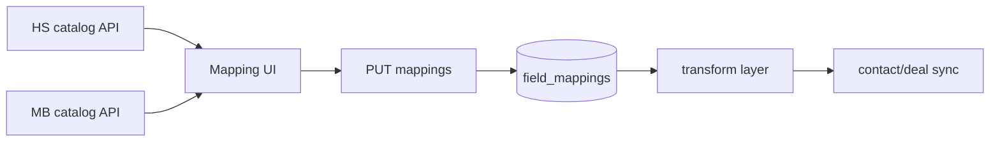

# Field mappings — living design doc

> **Branch:** `feature/field-mappings` (off stable `main` @ `6a277c7`)  
> **Last updated:** 2026-06-12  
> **Status:** Design / investigation — no mapping UI or catalog APIs yet

Use this file as the source of truth for the custom property-mapping feature. Update sections as work lands.

---

## Goal

Let each tenant map **Mindbody fields → HubSpot properties** (and later reverse) through the app UI:

- **Dynamic** property lists from both systems (not hardcoded business lists)
- **Searchable dropdowns** on both sides of each row
- **Object selector** (contact first; deals later with sale vs contract split)
- **Locked system/required mappings** (identity, email, dedup keys)
- **Type-aware** transforms at sync time (not raw `String()`)
- **Phase 2:** create HubSpot property from UI if it doesn’t exist

**MVP direction:** Contacts, Mindbody → HubSpot only. Map to **existing** HubSpot properties first.

---

## What exists today

| Layer | State |
|-------|--------|
| **DB** | `field_mappings` table: `tenant_id`, `entity_type`, `hubspot_property`, `mindbody_field`, `is_custom` |
| **Seed** | `DEFAULT_CONTACT_MAPPINGS` / `DEFAULT_DEAL_MAPPINGS` on OAuth install |
| **Settings API** | `GET/PUT /api/tenants/[tenantId]/settings` reads/writes `fieldMappings` |
| **Contact sync** | Uses `getFieldMappings` + `applyContactMappings` (MB→HS and HS→MB) |
| **Deal sync** | **Hardcoded** in `lib/sync/deals.ts` — ignores `field_mappings` |
| **Settings UI** | No mapping UI |
| **Catalog APIs** | None |
| **HubSpot props** | Fixed `mindbody_*` bootstrap in `lib/hubspot/properties.ts` |

### Key files

| Area | Path |
|------|------|
| Mappings + apply | `lib/sync/field-mappings.ts` |
| Contact sync | `lib/sync/contacts.ts` |
| Deal sync | `lib/sync/deals.ts` |
| DB schema | `supabase/migrations/20250601000000_initial_schema.sql` |
| Types | `lib/db/types.ts` → `FieldMapping` |
| Settings API | `app/api/tenants/[tenantId]/settings/route.ts` |
| HS property create | `lib/hubspot/properties.ts` |
| OAuth scopes | `lib/hubspot/config.ts` (`crm.schemas.*` already included) |

---

## Architecture fit

**Yes — expandable without rewrite.** `field_mappings` and contact sync path were built for this. Gaps are discovery APIs, UI, type transforms, and deal wiring.



---

## Holes & risks (do not skip)

### 1. Mindbody custom fields are not flat keys

Client payload uses:

```json
"CustomClientFields": [{ "Id": 3, "Value": "..." }]
```

Mapper cannot use `mindbody[fieldName]` only. Need stable keys, e.g.:

- `Email` — standard field
- `HomeLocation.Id` — nested path
- `custom:3` — custom field by ID (label from `GET /client/customclientfields`)

### 2. Deals = two Mindbody shapes

- **Sale:** `saleId`, `totalAmount`, `clientId`, …
- **Contract:** `clientContractId`, `contractName`, `contractStartDateTime`, …

`entity_type: deal` alone is insufficient. Need `mindbody_source`: `sale` | `contract` (or separate UI tabs).

### 3. Type transforms are mandatory

Current code: `props[m.hubspot_property] = String(val)` — breaks dates, enums, booleans.

Need `extractMindbodyValue()` + `formatForHubspot()` with compatibility checks.

### 4. Locked system mappings

Users must not remove:

| HubSpot | Mindbody | Why |
|---------|----------|-----|
| `email` | `Email` | Contact upsert requires email |
| `mindbody_client_id` | `Id` | Dedup / identity |
| `mindbody_sale_id` | (sale) | Deal dedup |
| `mindbody_contract_id` | (contract) | Deal dedup |

HubSpot **read-only** properties must be excluded from writable mappings.

### 5. Reverse sync (HS → MB) is harder

`mindbodyClientFromHubspot` only handles name/email/phone with fallbacks. Full dynamic reverse mapping + Mindbody `UpdateClient` rules (e.g. cross-regional email) = **phase 2**.

### 6. Mapping changes don’t backfill

Changing mappings leaves existing HubSpot records stale until manual backfill.

### 7. Catalog size

HubSpot can have hundreds of properties. Cache per tenant (or load once per page); filter combobox client-side.

### 8. DB uniqueness

`UNIQUE (tenant_id, entity_type, hubspot_property)` — one Mindbody source per HubSpot property. Decide whether to block two HS properties → same MB field.

---

## Mindbody multi-location (related, out of scope for mappings v1)

- **One Site ID** + multiple **Location IDs** under it → current app syncs all clients; no `HomeLocation` on HubSpot yet.
- **Multiple Site IDs** (cross-regional) → one `site_id` per tenant today; not supported.

See conversation context; optional future: `mindbody_home_location_id` on contacts.

---

## Database — planned changes

Current schema is enough for a spike. Recommended migration before save/validation:

```sql
ALTER TABLE field_mappings
  ADD COLUMN direction sync_direction DEFAULT 'mb_to_hs',
  ADD COLUMN mindbody_field_type TEXT,
  ADD COLUMN hubspot_property_type TEXT,
  ADD COLUMN is_system BOOLEAN DEFAULT false,
  ADD COLUMN mindbody_source TEXT;  -- null | 'sale' | 'contract'
```

| Column | Purpose |
|--------|---------|
| `mindbody_field_type` / `hubspot_property_type` | Cached types for transform + UI warnings |
| `is_system` | Locked rows in UI |
| `mindbody_source` | Deal sale vs contract |
| `direction` | Per-row MB→HS / HS→MB (later) |

No property catalog table for MVP — fetch live from APIs.

---

## Backend — planned APIs

```
GET  /api/tenants/:id/mapping/catalog/hubspot?object=contacts|deals
GET  /api/tenants/:id/mapping/catalog/mindbody?entity=contact|sale|contract
GET  /api/tenants/:id/mapping/fields
PUT  /api/tenants/:id/mapping/fields
```

### HubSpot catalog

- Source: `GET https://api.hubapi.com/crm/v3/properties/{objectType}`
- Normalize: `{ name, label, type, fieldType, readOnly, options?, groupName }`
- Scopes: already have `crm.schemas.contacts.read`, `crm.schemas.deals.read`

### Mindbody contact catalog

Combine:

1. Standard Client fields (from API schema / sample client shape)
2. `GET /public/v6/client/customclientfields` — studio-specific definitions
3. Nested paths: `HomeLocation.Id`, `HomeLocation.Name`, etc.

### Mindbody deal catalogs

Separate field lists for **sale** and **contract** payloads (from webhook shapes + API).

### Transform layer (new module)

```
lib/sync/transforms.ts   (or lib/mapping/)
  extractMindbodyValue(record, fieldKey)
  formatForHubspot(value, hsType, mbType)
  validateMappingPair(hsProp, mbField) → { ok, warnings, errors }
```

Wire into `applyContactMappings` and later `applyDealMappings`.

---

## Type compatibility (UI + server)

| HubSpot type | Accept from Mindbody |
|--------------|----------------------|
| `string` / `text` | string, number, bool (coerce to string) |
| `number` | number, numeric string |
| `date` / `datetime` | ISO dates, Mindbody datetime fields |
| `enumeration` | string **only** if value ∈ HS options |
| `bool` | boolean, `"true"` / `"false"` |

**Recommendation:** strict block for enum + date mismatches; warn on string/number coercion.

---

## Frontend — planned UI

**Location:** Settings → **Field mappings** (new section or `/settings/mappings`)

- Object selector: Contact (MVP) → Deal later
- Direction: MB → HS (MVP)
- Table rows: HubSpot combobox | Mindbody combobox | status (✓ / ⚠)
- Locked rows for system mappings
- “Add mapping” / delete row (non-system)
- Save → `PUT` with server validation errors per row
- Searchable combobox: client-side filter on cached catalog; show type badge

**Phase 2:** “Create new HubSpot property” modal on HS side.

---

## Working agreement

1. **One step = one small commit** on `feature/field-mappings` (merge to `main` only when a phase is stable).
2. **No sync behavior changes** until step 1.6 (transform layer) — catalog and UI steps cannot break production sync.
3. **Every step has a verify checklist** — we don’t start the next step until the current one passes.
4. **Run `npm run typecheck`** after each backend step.
5. **`main` stays deployable** — feature branch can use a separate Vercel preview if needed.

---

## Incremental build plan (verify before moving on)

### Phase A — Read-only APIs (zero sync risk)

#### Step 1.1 — HubSpot contact properties catalog API
- **Build:** `GET /api/tenants/[tenantId]/mapping/catalog/hubspot?object=contacts`
- **Verify:**
  - [ ] Logged in → JSON returns `{ properties: [...] }` with `email`, `firstname`, `mindbody_client_id`
  - [ ] Each item has `name`, `label`, `type`, `readOnly`
  - [ ] Logged out → `401`
  - [ ] `npm run typecheck` passes
- **Does NOT change:** sync, settings save, UI
- **Status:** ✅ Implemented — pending manual verify on Vercel/local

#### Step 1.2 — HubSpot deal properties catalog API
- **Build:** Same route, `?object=deals`
- **Verify:**
  - [ ] Returns `dealname`, `amount`, `mindbody_sale_id`, etc.
  - [ ] `?object=invalid` → `400`

#### Step 1.3 — Mindbody contact field catalog API
- **Build:** `GET /api/tenants/[tenantId]/mapping/catalog/mindbody?entity=contact`
- **Verify:**
  - [ ] Returns standard fields (`Email`, `FirstName`, …) with `key` + `label` + `type`
  - [ ] Returns custom fields from `GET /client/customclientfields` as `custom:{id}`
  - [ ] Returns nested fields (`HomeLocation.Id`, …)
  - [ ] Mindbody not configured → clear error (`400` or `422`)
  - [ ] `npm run typecheck` passes

#### Step 1.4 — List saved mappings API
- **Build:** `GET /api/tenants/[tenantId]/mapping/fields?entity=contact`
- **Verify:**
  - [ ] Returns current `field_mappings` rows for tenant + default seed data
  - [ ] Matches what’s in Supabase `field_mappings` table

---

### Phase B — Schema & validation (still no sync changes)

#### Step 2.1 — DB migration for mapping metadata
- **Build:** Migration adds `is_system`, `hubspot_property_type`, `mindbody_field_type` (minimal set first)
- **Verify:**
  - [ ] Migration applies cleanly on Supabase
  - [ ] Existing rows still readable; defaults sensible
  - [ ] Seed marks `email`/`Id` mappings as `is_system: true`

#### Step 2.2 — Mapping validation module (pure functions)
- **Build:** `lib/mapping/validate.ts` — type compatibility, locked field rules
- **Verify:**
  - [ ] Unit-style: known good pairs pass; enum/date mismatches fail
  - [ ] No imports from sync yet — isolated module
  - [ ] `npm run typecheck` passes

---

### Phase C — UI (read-only first)

#### Step 3.1 — Mapping page shell
- **Build:** `/settings/mappings` or section on Settings — object tabs, loading states
- **Verify:**
  - [ ] Page loads when logged in; redirects when not
  - [ ] Shows “Contact mappings” heading, no errors in console

#### Step 3.2 — Display catalogs (read-only lists)
- **Build:** Fetch both catalog APIs; render searchable lists or disabled comboboxes
- **Verify:**
  - [ ] HubSpot side shows 50+ properties, search filters client-side
  - [ ] Mindbody side shows standard + custom fields
  - [ ] Types/labels visible in UI

#### Step 3.3 — Display saved mappings
- **Build:** Show current rows from step 1.4; system rows visually locked
- **Verify:**
  - [ ] Default mappings appear (email↔Email, etc.)
  - [ ] Locked rows cannot be removed in UI

---

### Phase D — Save mappings (still old sync transform)

#### Step 4.1 — Save mappings API
- **Build:** `PUT /api/tenants/[tenantId]/mapping/fields` with validation
- **Verify:**
  - [ ] Save valid mapping → persists in Supabase
  - [ ] Remove system mapping → rejected
  - [ ] Incompatible types → `400` with per-row errors
  - [ ] Reload page → shows saved state

#### Step 4.2 — Editable UI (add/remove rows, save button)
- **Build:** Wire comboboxes + save to PUT endpoint
- **Verify:**
  - [ ] Add `firstname` ↔ `FirstName`, save, refresh → still there
  - [ ] Invalid pair shows error message
  - [ ] **Contact test sync still works** (may still use `String()` — expected until Phase E)

---

### Phase E — Sync actually uses mappings correctly

#### Step 5.1 — `extractMindbodyValue` + `formatForHubspot`
- **Build:** `lib/mapping/transform.ts`; tests for flat, nested, `custom:{id}`
- **Verify:**
  - [ ] Extract `Email`, `HomeLocation.Id`, `custom:3` from sample payloads
  - [ ] Date/bool/number format correctly for HubSpot

#### Step 5.2 — Wire contact sync
- **Build:** Replace `String(val)` in `applyContactMappings`
- **Verify:**
  - [ ] Test sync 1 contact with custom mapping → correct value in HubSpot property history
  - [ ] Email + `mindbody_client_id` still always set
  - [ ] Bad mapping skipped or logged, doesn’t crash whole run

---

### Phase F — Deals (later)

#### Step 6.1 — Mindbody sale + contract catalogs
#### Step 6.2 — Deal mapping UI (tabs or source column)
#### Step 6.3 — Wire `lib/sync/deals.ts` to mappings

---

### Phase G — Nice-to-have (later)

- Create HubSpot property from UI
- HS → MB dynamic reverse
- Backfill prompt on save

---

## Build order (legacy checklist — see incremental plan above)

- [x] **1.1** HubSpot contact catalog API
- [ ] **1.2** HubSpot deal catalog API
- [ ] **1.3** Mindbody contact catalog API
- [ ] **1.4** List saved mappings API
- [ ] **2.1** DB migration
- [ ] **2.2** Validation module
- [ ] **3.1–3.3** UI read-only
- [ ] **4.1–4.2** Save + editable UI
- [ ] **5.1–5.2** Transform + contact sync
- [ ] **6.x** Deals
- [ ] **7.x** Create HS property / reverse / backfill

---

## Progress log

| Date | Change |
|------|--------|
| 2026-06-12 | **Step 1.1:** HubSpot property catalog API (`GET .../mapping/catalog/hubspot?object=contacts\|deals`). |
| 2026-06-12 | Agreed incremental plan with per-step verification. Phase A starts at step 1.1 (HS contact catalog API). |
| 2026-06-12 | Initial design doc. Branch `feature/field-mappings` created. E2E on `main`: contacts (partial) + deals (6/6) validated. |
| | Stashed locally (not on branch): logging UI improvements for Reports run detail |

---

## Open decisions

1. **Strict vs permissive** type mismatch on save?
2. **Allow** two HubSpot properties → same Mindbody field?
3. **Deals UI:** one page with source column vs two tabs?
4. **MVP:** existing HS properties only, or include “create property” in v1?
5. **Re-sync** on save: automatic queue vs manual backfill button?

---

## References

- [HubSpot Properties API](https://developers.hubspot.com/docs/api/crm/properties)
- [Mindbody Public API v6](https://developers.mindbodyonline.com/PublicDocumentation/V6)
- Mindbody custom fields: `GET /client/customclientfields`
- Stable `main` deploy: `https://testhubspotapp.vercel.app`
